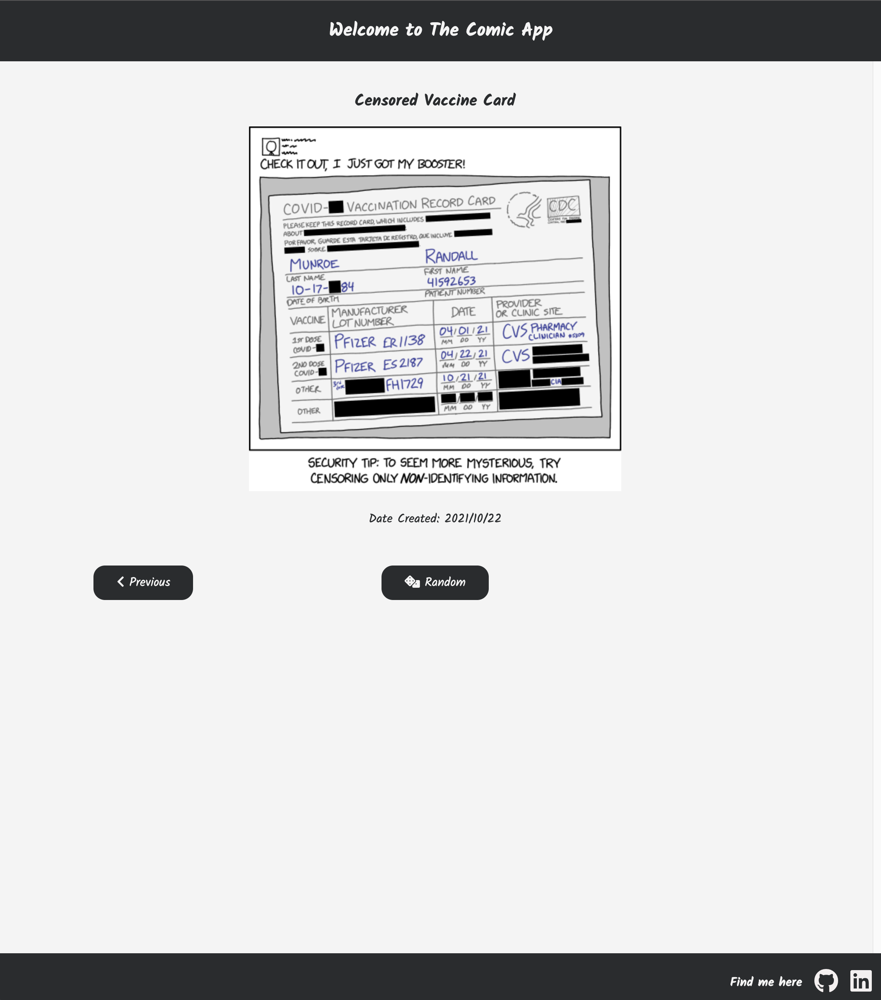

# [Comic App](https://comic-app-lambigegg.netlify.app/)

- This is a simple comic app using [xkcd](https://xkcd.com/json.html) api.

  - Vanilla JS + Vanilla CSS

  - It also uses Express as the backend to bypass the CORS issue when fetch comics from xkcd
   

### It is hosted on Netlify.

- Here is the link: https://comic-app-lambigegg.netlify.app/

### This is a screenshot of the app

### Functionalities

- :white_check_mark: The homepage displays the latest comic
- :white_check_mark: There are two buttons for navigation
  - The previous button goes to the previous comic
  - The next button goes to the next comic
- :white_check_mark: There is also a random button to go to a random comic
- :white_check_mark: It is responsive! Open it on your mobile device
- :white_check_mark: Change the number after '#' in the url will take you to a specific comic
- :white_check_mark: It displays the transcript and the creation date of the comic
